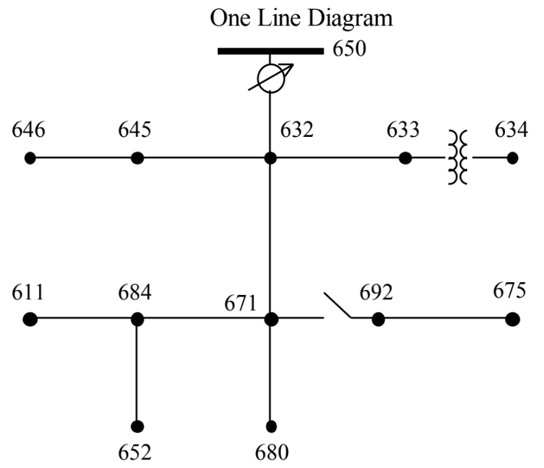

# ORA Final Project : Supply Chain and Distribution System
**Implementation of a Distributionally Robust Optimization Model on IEEE 13-Node System**

## Editors and Advisor
| Identity | Name | Contact Information |
| :--- | :--- | :--- |
| Editor/ Student | **胡銘哲 (Min-Zhe, Hu)** | [Email](mailto:youremail@example.com) |
| Editor/ Student | **王宥惠 (Yu-Hui, Wang)** | [Email](mailto:huihui.162636@gmail.com) |
| Advisor |  **李家岩 (Chia-Yen Lee, Ph.D.)**

## Table of Contents
[1.Background and Motivation](#background-and-motivation)
   * [1.1 Motivation](#motivation)
   * [1.2 Background](#background)
   * [1.3 Problem Definition](#problem-definition)

[2.Methodology](#methodology)

[3.Data Collection and Analysis Result](#data-collection-and-analysis-result)

[4.Conclusion](#conclusion)
   * [4.1 Data Collection](#data-collection)
   * [4.2 Analysis](#analysis)
   * [4.3 Results and Managerial Implications](#results-and-managerial-implications)

[5.References](#references)
  

## 1. Background and Motivation
### 1.1 Motivation
Electricity is extremely critical for everyone in modern society, yet traditional network planning often neglect "worst-case" scenarios, focusing instead on daily load growth or single-point failures. This leaves our systems vulnerable to natural disasters, such as hurricanes and earthquakes, which can cause catastrophic, simultaneous outages. Therefore, our primary goal is to prioritize resilience.

To achieve this, we adopt a progressive implementation strategy. We begin by validating the basic grid topology, then move to simulating known disaster paths. Finally, we incorporate uncertainty regarding disaster types and probabilities. By systematically optimizing line hardening and backup generator allocation, this project aims to ensure the continuity of power systems and minimize economic losses when the grid is tested to its limits.

### 1.2 Background
Modern power distribution systems are inherently vulnerable to natural disasters due to their environmentally exposed infrastructure. Extreme events can damage multiple components simultaneously instead of typical "single-point failure" scenarios.

The core problem is that conventional planning models are insufficient for these high-impact events. Traditional methods focus on meeting load growth or maintaining reliability under "N-1 criteria" (assuming only one component fails at a time), which fail to address the simultaneous, multi-component outages caused by extreme weather.

This creates a critical need for Resilience-Oriented Planning. By proactively hardening lines and allocating backup distributed generators (B-DGs), we can robustify the distribution network. This approach benefits us by enhancing the system's ability to quickly recover from disasters, ensuring the continuity of essential power services when they are needed most.

### 1.3 Problem Definition
This project implements a resilience-oriented optimization model to determine the optimal strategies for line hardening and DG allocation, aiming to minimize the expected load shedding penalties when facing extreme weather events.

## 2. Methodology

## 3. Data Collection and Analysis Result

## 4. Conclusion
### 4.1 Data Collection
> Phase 1: Basic Model (Simplified IEEE 13-Node Distribution System)

This project references the **IEEE 13-node Test Feeder** as the test model. It is a standard radial distribution test system featuring transformers, voltage regulators, and switches, commonly used as a benchmark for power flow analysis in distribution networks.
 
  Source: W. H. Kersting
 
 
The following figure illustrates the **modified IEEE 13-node distribution system** used in this project. The diagram details the network configuration with the following parameters:  
**Node indices:** Standard numbers (e.g., 1, 2, 10).  
**Active load:** Values shown in parentheses (e.g., (66.67), (133.33)).  
**Line indices:** Numbers inside orange circles.  
 
  
Source: Zhang, G., Zhang, F., Zhang, X., Wu, Q., & Meng, K. (2020) 
 
 
Simplified assumptions have been made regarding information omitted from the original paper, such as reactive power (Q) loads, line R/X ratios, and specific connectivity. Specifically, all 15 lines are assumed to share identical electrical characteristics regardless of length (e.g., R = 0.1 Ω and X = 0.1 Ω).
| Line ID | Connection | R (Ω) | X (Ω) |
| :--- | :--- | :--- | :--- |
| 1 | 1-2 | 0.1 | 0.1 |
| 2 | 2-3 | 0.1 | 0.1 |
| 3 | 3-4 | 0.1 | 0.1 |
| 4 | 2-5 | 0.1 | 0.1 |
| 5 | 5-6 | 0.1 | 0.1 |
| 6 | 6-7 | 0.1 | 0.1 |
| 7 | 7-8 | 0.1 | 0.1 |
| 8 | 3-8 | 0.1 | 0.1 |
| 9 | 8-9 | 0.1 | 0.1 |
| 10 | 4-9 | 0.1 | 0.1 |
| 11 | 2-10 | 0.1 | 0.1 |
| 12 | 10-11 | 0.1 | 0.1 |
| 13 | 11-12 | 0.1 | 0.1 |
| 14 | 12-13 | 0.1 | 0.1 |
| 15 | 3-13 | 0.1 | 0.1 |

Regarding the load data, we assume that the reactive power (Q) for all nodes is 0 kVAr.
 

| Node ID | P load (kW) | Q load (kVAr) |
| :--- | :--- | :--- |
| 1 | 0 | 0 |
| 2 | 66.67 | 0 |
| 3 | 85 | 0 |
| 4 | 100 | 0 |
| 5 | 56.67 | 0 |
| 6 | 76.67 | 0 |
| 7 | 56.67 | 0 |
| 8 | 100 | 0 |
| 9 | 142.67 | 0 |
| 10 | 0 | 0 |
| 11 | 133.33 | 0 |
| 12 | 281 | 0 |
| 13 | 56.67 | 0 |
  

** Parameters, Objective Function, and Constraints **

---
>Phase 2: 

### 4.2 Analysis

### 4.3 Results and Managerial Implications
> Basic Model (Simplified IEEE 13-Node Distribution System)

The primary goal for this phase, which is building a basic model, is to **minimize system performance loss**. We formulate the objective function as the minimization of total load shedding, defined as the summation of unserved active power across all nodes.  
To ensure physical realism and maintain a logical radial topology, a minimal penalty cost for switching operations has been incorporated to prevent "ghost flows" (mathematical loops).  
In the following figures, the system status is represented as follows:  
 * On the top of each figure will mention which line(s) is/are broken, and also record the total load shedding.
 * Green Lines (Switch = 1): Represent active lines carrying power flow.  
 * Red Dashed Lines (Switch = 0): Represent broken or open lines with no flow.  
 * The numerical labels indicate the magnitude of active power flow on each line.
   
 These result figures showing that our basic model is working properly.
 

 

## 5. References
Zhang, G., Zhang, F., Zhang, X., Wu, Q., & Meng, K. (2020). A multi-disaster-scenario distributionally robust planning model for enhancing the resilience of distribution systems. International Journal of Electrical Power and Energy Systems, 122, Article 106161. https://doi.org/10.1016/j.ijepes.2020.106161

W. H. Kersting, "Radial distribution test feeders," 2001 IEEE Power Engineering Society Winter Meeting. Conference Proceedings (Cat. No.01CH37194), Columbus, OH, USA, 2001, pp. 908-912 vol.2, doi: 10.1109/PESW.2001.916993. keywords: {Conductors;Load modeling;Distributed computing;System testing;Capacitors;Phase transformers;Impedance;Shunt (electrical);Aluminum;Copper}, https://ieeexplore.ieee.org/document/916993
