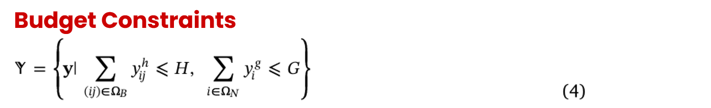

# ORA Final Project :  Resilient Power Distribution Planning via Two-Stage Robust Optimization
**Implementation of a Distributionally Robust Optimization Model on IEEE 13-Node System**

## Editors and Advisor
| Identity | Name | Contact Information |
| :--- | :--- | :--- |
| Editor/ Student | **胡銘哲 (Min-Jhe, Hu)** | [Email](mailto:ryanhutech@gmail.com) |
| Editor/ Student | **王宥惠 (Yu-Hui, Wang)** | [Email](mailto:huihui.162636@gmail.com) |
| Advisor |  **李家岩 (Chia-Yen Lee, Ph.D.)**

## Table of Contents
[1.Background and Motivation](#background-and-motivation)
   * [1.1 Motivation](#motivation)
   * [1.2 Background](#background)
   * [1.3 Problem Definition](#problem-definition)

[2.Methodology](#methodology)

[3.Data Collection and Analysis Result](#data-collection-and-analysis-result)
   * [3.1 Data Collection](#data-collection)
   * [3.2 Analysis](#analysis)
   * [3.3 Results and Managerial Implications](#results-and-managerial-implications)

[4.Conclusion](#conclusion)

[5.References](#references)
  

## 1. Background and Motivation
### 1.1 Motivation
Electricity is extremely critical for everyone in modern society, yet traditional network planning often neglect "worst-case" scenarios, focusing instead on daily load growth or single-point failures. This leaves our systems vulnerable to natural disasters, such as hurricanes and earthquakes, which can cause catastrophic, simultaneous outages. Therefore, our primary goal is to prioritize resilience.

To achieve this, we adopt a progressive implementation strategy. We begin by validating the basic grid topology, then move to simulating known disaster paths. Finally, we incorporate uncertainty regarding disaster types and probabilities. By systematically optimizing line hardening and backup generator allocation, this project aims to ensure the continuity of power systems and minimize economic losses when the grid is tested to its limits.

### 1.2 Background
Modern power distribution systems are inherently vulnerable to natural disasters due to their environmentally exposed infrastructure. Extreme events can damage multiple components simultaneously instead of typical "single-point failure" scenarios.

The core problem is that conventional planning models are insufficient for these high-impact events. Traditional methods focus on meeting load growth or maintaining reliability under "N-1 criteria" (assuming only one component fails at a time), which fail to address the simultaneous, multi-component outages caused by extreme weather.

This creates a critical need for Resilience-Oriented Planning. By proactively hardening lines and allocating backup distributed generators (B-DGs), we can robustify the distribution network. This approach benefits us by enhancing the system's ability to quickly recover from disasters, ensuring the continuity of essential power services when they are needed most.

### 1.3 Problem Definition
This project implements a resilience-oriented optimization model to determine the optimal strategies for line hardening and DG allocation, aiming to minimize the expected load shedding penalties when facing extreme weather events.

## 2. Methodology

## 3. Data Collection and Analysis Result

### 3.1 Data Collection
We have structured the project into three key stages to achieve our goals step-by-step. The figure below illustrates how we break down specific tasks to complete the project in phases. 
**Phase 1:** In this stage, we build the foundational power transmission model. We then simulate several faults at different targets node to check two things: whether the power load is calculated correctly, and if electricity is properly distributed to every connected node. 
**Phase 2:** In addition to the load shedding costs from Phase 1, we introduce costs for strengthening lines and installing generators. We assume specific scenarios where grid lines are targeted by attacks. The goal is to determine the minimum upfront investment required to minimize the overall damage to the system. 
**Phase 3:** In this final phase, we introduce uncertainty by modeling two distinct attack scenarios ($S_1$ and $S_2$). Each scenario differs in the attacked location and number of compromised lines, as well as their probability of occurrence. Our objective is to analyze how optimal reinforcement strategies (line hardening and generator placement) shift under different risk profiles. Ultimately, we aim to calculate the minimum expected total cost weighted across all potential failure probabilities. 
 
 

---
First, we will introduce how we build our basic model. 
This project references the **IEEE 13-node Test Feeder** as the test model. It is a standard radial distribution test system featuring transformers, voltage regulators, and switches, commonly used as a benchmark for power flow analysis in distribution networks.
 
  Source: W. H. Kersting
 
The following figure illustrates the **modified IEEE 13-node distribution system** used in this project. The diagram details the network configuration with the following parameters:  
**Node indices:** Standard numbers (e.g., 1, 2, 10).  
**Active load:** Values shown in parentheses (e.g., (66.67), (133.33)).  
**Line indices:** Numbers inside orange circles.  
 
  
Source: Zhang, G., Zhang, F., Zhang, X., Wu, Q., & Meng, K. (2020) 
 
 
Simplified assumptions have been made regarding information omitted from the original paper, such as reactive power (Q) loads, line R/X ratios, and specific connectivity. Specifically, all 15 lines are assumed to share identical electrical characteristics regardless of length (e.g., R = 0.1 Ω and X = 0.1 Ω).
| Line ID | Connection | R (Ω) | X (Ω) |
| :--- | :--- | :--- | :--- |
| 1 | 1-2 | 0.1 | 0.1 |
| 2 | 2-3 | 0.1 | 0.1 |
| 3 | 3-4 | 0.1 | 0.1 |
| 4 | 2-5 | 0.1 | 0.1 |
| 5 | 5-6 | 0.1 | 0.1 |
| 6 | 6-7 | 0.1 | 0.1 |
| 7 | 7-8 | 0.1 | 0.1 |
| 8 | 3-8 | 0.1 | 0.1 |
| 9 | 8-9 | 0.1 | 0.1 |
| 10 | 4-9 | 0.1 | 0.1 |
| 11 | 2-10 | 0.1 | 0.1 |
| 12 | 10-11 | 0.1 | 0.1 |
| 13 | 11-12 | 0.1 | 0.1 |
| 14 | 12-13 | 0.1 | 0.1 |
| 15 | 3-13 | 0.1 | 0.1 |

Regarding the load data, we assume that the reactive power (Q) for all nodes is 0 kVAr.
 

| Node ID | P load (kW) | Q load (kVAr) |
| :--- | :--- | :--- |
| 1 | 0 | 0 |
| 2 | 66.67 | 0 |
| 3 | 85 | 0 |
| 4 | 100 | 0 |
| 5 | 56.67 | 0 |
| 6 | 76.67 | 0 |
| 7 | 56.67 | 0 |
| 8 | 100 | 0 |
| 9 | 142.67 | 0 |
| 10 | 0 | 0 |
| 11 | 133.33 | 0 |
| 12 | 281 | 0 |
| 13 | 56.67 | 0 |

---

**Parameters, Objective Function, and Constraints**  
 
&bull; **Parameters :**  
 
Parameters for *phase 1* task: 
| Notation | Description |
| :--- | :--- |
| R, X | The resistance (DC) and reactance (AC) of line $ij$. |
| P_load | Active load at node $i$ and time $t$. |
| Q_load | Reactive load at node $i$ and time $t$. |
| Big_M | The big number used in model formulation and linearization. ( =10) |

*Phase 2* extends the previous parameter set with the following: 
| Notation | Description | Value we set |
| :--- | :--- | :--- |
| $C_i^g$ | The cost required to install a backup generator unit. | $1500 / kW |
| $C_{ij}^h$ | The cost required to harden a line. | 400 per line |
| $C$ | The penalty cost for unserved energy (value of lost load). | $14 / kW |
| $P_i^{max}$ | The maximum power output of a backup generator. | 100 kW |
| $H$ | The penalty cost for unserved energy (value of lost load). | $14 / kW |
| $K$ | Attacked lines for different scenarios | example: 2,6,... |

*Phase 3* extends the previous parameter set with the following: 
We consider *2 distinct disaster scenarios (A and B)* combined with *3 different probability sets (1,2,3)*, resulting in a total of *6 simulation cases*. The specific assumptions for these scenarios are outlined below:
| Distinct Disaster Scenario | The Number of Line Broken | Broken Line ID | 
| :--- | :--- | :--- |
| A | 2 | 2, 11 |
| B | 3 | 4, 6, 11 |
| C | 5 | 2, 5, 8, 14, 15 |

| Probability Set | Probability for Disaster 1 | Probability for Disaster 2 | 
| :--- | :--- | :--- |
| 1 | 90% | 10% |
| 2 | 50% | 50% |
| 3 | 10% | 90% |

 

&bull; **Constraints :**  

Constraints for *phase 1* task: 
 
Following equation shows Power Balance. It ensures that for every node, the net power flowing OUT minus the power flowing IN must equal the power local generation made minus the net load demand. The first equation is for active power flow, the second is for reactive power flow. 
 
 
Following equation manages Voltage Drop using a Big-M formulation. The logic is: if the line is connected ($v=1$), the voltage drop physics are strictly enforced. If the line is cut ($v=0$), the Big-M removes the restriction, so the voltages on both sides become independent. 
 
Following equation sets the Line Capacity Limits. It ensures that power flow on any connected line does not exceed its maximum rating. 
 
 
Following equation defines the DG Output Limits. It ensures backup generators do not produce more power than their physical capacity. 
 
 
Following equation defines Actual Load Shedding. This means that we cannot cut off more power than the original demand at any node. 
 
 
Following equation shows Voltage Safety, keeping every node’s voltage within the safe minimum and maximum limits. 
 
 
Following equation defines our Switching Logic. Even if a line is physically working ($v^d$), we can actively choose to switch it off ($v^w$).The Final Status ($v^q$) follows a strict rule: The line is active AND the switch is turned on. If either condition is zero, power cannot flow through the node. 
 
 
Following equation ensures the grid remains radial—meaning a tree-like structure with no loops, where disconnected areas form independent microgrids. We modified the original equation from paper into an inequality. This strictly limits the number of active lines to be less than the number of nodes minus islands, guaranteeing a safe, loop-free system. 
 
 
 
To achieve *phase 2 and 3* task, these constraints are also included: 
 
Following equation defines that the total number of hardened lines must not exceed our pre-set limit ($H$). Similarly, the number of installed backup generators must also remain within the initial budget ($G$). 
 
 
Following equation shows that the output active power p and reactive power Q of generator must not exceed its own generator power limit. 
 
 
Following equation determines the Line Status - whether a line is operational depends on two factors: whether it was hardened and whether it was destroyed by the disaster.  
 
 

&bull; **Variables :**  

Following shows the variables used in *Phase 1* task. First, we have Line Status Variables. These are binary values that simply tell us if a line is switched on or off. Second are the Flow Variables. These track the actual active and reactive power flowing through the lines. Third are Recourse Variables. These represent load shedding—the power we are forced to cut during an emergency when delivery is impossible. Finally, we have the State Variables, which represent the square of the nodal voltage. We constrain these within a safety range of plus or minus 10% to ensure system stability. 
 
 
Here we have additional variables for *Phase 2* task: Line Hardening Decision variables and DG Allocation Decision variable deciding which lines to harden and where to place generators. We also have a DG Power Output variable that can tell the output of generator. The last variable Attack Status indicates whether a line survives after an attack or damaged. 
 
 
In *Phase 3* task, we need to include following variables, which are similar to Phase 1, and also Phase 2 variables to finish this task. The difference between phase 3 and those of phase 1 is that different scenarios are included. 
 
 

&bull; **Objective Funtion:**  
 
The objective function varies across different phases. In this section, we present the specific mathematical formulations for all three phases. 
 
Here defines our *Phase 1* Objective Function. 
Our operational goal is to minimize the total load shedding under a specific scenario.
In our Gurobi implementation, we define this function Q simply as the sum of Delta P, which represents the total active power cut off from all nodes. 
 
 
In *Phase 2*, we add investment costs into our objective function. 
We need to minimize the total cost, which is the sum of investment costs for line hardening, DG installation, and the load shedding penalty.
There’s a little difference between our objective function and the one in the paper: our current model simplifies the load shedding term. Unlike the original paper, we didn’t include the probability-weighted ambiguity sets for multiple disaster scenarios, we only focusing first on the deterministic investment decisions. 
 
 
The formulation in *Phase 3* is similar to that of Phase 2. The key difference lies in modifying the objective function to account for the probability of occurrence across various disaster scenarios. 
 
 

### 3.2 Analysis

**Phase 1 : Basic Model (Simplified IEEE 13-Node Distribution System)**

The primary goal for this phase, which is building a basic model, is to **minimize system performance loss**. We formulate the objective function as the minimization of total load shedding, defined as the summation of unserved active power across all nodes.  
To ensure physical realism and maintain a logical radial topology, a minimal penalty cost for switching operations has been incorporated to prevent "ghost flows" (mathematical loops).  
In the following figures, the system status is represented as follows:  
 * On the top of each figure will mention which line(s) is/are broken, and also record the total load shedding.
 * Green Lines (Switch = 1): Represent active lines carrying power flow.  
 * Red Dashed Lines (Switch = 0): Represent broken or open lines with no flow.  
 * The numerical labels indicate the magnitude of active power flow on each node.
   
 These result figures showing that our basic model is working properly.
 
 
1. This result validates our basic model structure. Since Line 1 (L1) is the main power source, breaking it cuts off the entire network, resulting in 100% load shedding (1155.35 kW), which equal to the sum of magnitude of active power flow on each node. This confirms that our grid topology and power flow logic are built correctly. 
 
2. This figure illustrates the network of the Phase 1 basic model under a Line 11 (L11) failure scenario. L11 is marked with a dashed red line, indicating that the line is damaged and disconnected; therefore, no current flows through it. L6 and L10 remain in an open state (zero current). This is to strictly adhere to the Radial Topology constraint of distribution networks, preventing the formation of closed loops and ensuring operational safety. L12 shows no current flow primarily because the connected Node 10 has a load demand of 0 kW.  
 
3. This figure illustrates the network of the Phase 1 basic model under a dual-failure scenario where both Line 2 (L2) and Line 7 (L7) are damaged simultaneously. With the main feeder line L2 broken, the system cannot supply the right side of the grid directly. The model successfully reroutes a significant amount of power (899 kW) through the upper loop (L11 -> L12 -> L13 -> L14 -> L15) to reach Node 3 and its downstream nodes. L9 remains open (dashed red line) to maintain the Radial Topology.  
 
4. This figure illustrates the network of the Phase 1 basic model under a severe triple-failure scenario where L2, L11, and L15 are simultaneously damaged. The failure of L11 and L15 completely isolates the upper section of the grid (Nodes 10, 11, 12, 13) from the main power source. With no alternative path available, this entire section experiences a blackout, contributing significantly to the 551.00 kW total load shedding. 

 
From these examples, we can confirm that our grid topology is built correctly. Next, we will move on to the next phase. If you need the source code for the grid, please refer to [code](https://github.com/yoo-wang/ORA-Final-Project-Supply-Chain-and-Distribution-System/blob/main/codes/phase_1_Basic%20Model.py)
 
 

> Phase 2 : Deterministic Resilience Planning
 

 
 
> Phase 3 : Two-Scenario Robust Planning

### 3.3 Results and Managerial Implications

## 4. Conclusion

## 5. References
Zhang, G., Zhang, F., Zhang, X., Wu, Q., & Meng, K. (2020). A multi-disaster-scenario distributionally robust planning model for enhancing the resilience of distribution systems. International Journal of Electrical Power and Energy Systems, 122, Article 106161. https://doi.org/10.1016/j.ijepes.2020.106161

W. H. Kersting, "Radial distribution test feeders," 2001 IEEE Power Engineering Society Winter Meeting. Conference Proceedings (Cat. No.01CH37194), Columbus, OH, USA, 2001, pp. 908-912 vol.2, doi: 10.1109/PESW.2001.916993. keywords: {Conductors;Load modeling;Distributed computing;System testing;Capacitors;Phase transformers;Impedance;Shunt (electrical);Aluminum;Copper}, https://ieeexplore.ieee.org/document/916993
